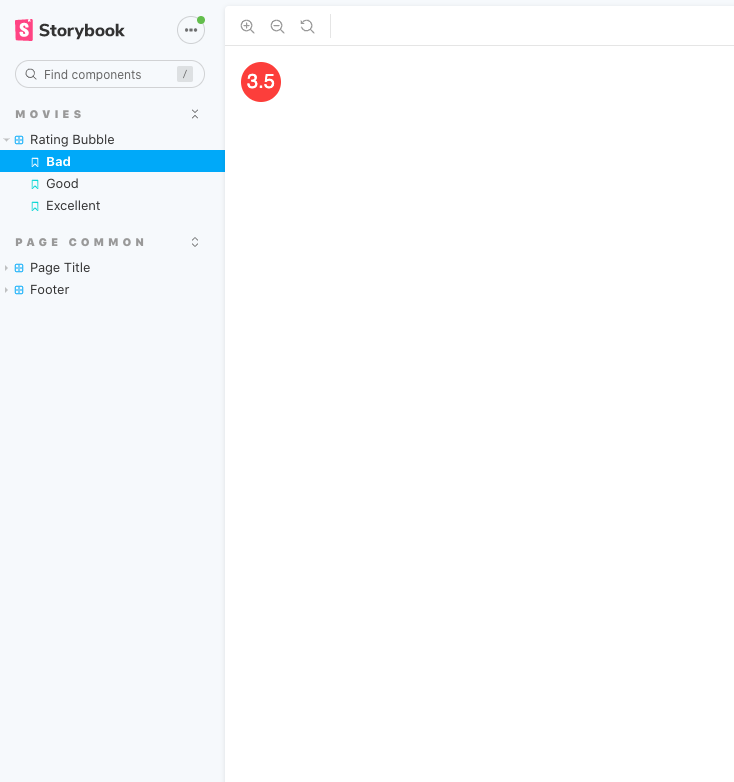

# Assignment 1 - Online Movie SPA

Name: Eoin Hearne

## Overview

The online movie application, Film Finder, is based on the [TMDB API](https://developers.themoviedb.org/3/getting-started/introduction). It allows guest users to view and filter popular, upcoming and top rated movies. Users can also register to add movies to their favourites and create custom wishlists to add as many movies as they like to.

## Installation Requirements

The Film Finder application relies on the API created for assignment 2 which can be found [here](https://github.com/ojoesuff/movies-online-api). In order to run the application, clone this repo along with the API repo and run 

```bat
npm install && npm start
```

## API Integration

To start the API, clone the repo and follow the [installation instructions](https://github.com/ojoesuff/movies-online-api). Once the application successfully connects to the MondoDB database and the API, you will be greeted with the landing page, displaying the most popular movies.


## Contexts

There are 4 contexts used to dynamically update various components in the application.

### authContext

The authentication context is used to authenticate a user upon login. Once a user successfully logs in, the context updates the clients local storage with the bearer token retrieved from the API call, and tells other components that the user is logged in by updating ```isAuthenicated``` to true and assigning the ```userName``` to allow retrieval of the users favourites and wishlists.

This context also handles user registration. When a user registers, they must login before they become fully authenticated.

The logout function is also handled by the authContext. It resets the ```userName``` and ```isAuthenicated``` while removing the token from local storage.

### moviesContext

The moviesContexts handles anything movie related. It contains 4 different types of movies:

1. Movies based on TMDBs discover movie API.
2. Upcoming movies based on TMDBs upcoming movie API.
3. Top rated movies based on TMDBs top rated movie API.
4. Favourites which uses the built API to retrieve a users favourites.

Its also handles adding and removing a users favourites as well as adding and removing movies from wishlists. The moviesContext looks after adding reviews for movies also.

### genresContext

The genres context simply returns an array of all the genres found in the API.

### wishlistsContext

The wishlists context retrieves all the users wishlists by username, which contain references to individual movies. It also has common wishlists functions such as delete/add wishlist and delete/add movie to wishlist.

## Templates

All pages in the application use a common template page. This page contains the header, footer and space for the page content.

The movie template uses the common template and adds a list of movies, such as favourites. A template details pages also uses the common template and is used to display the movie detail.

## Header

The header is found on every page and contains the logo and a menu. The menu is a group of buttons when displayed on larger screens but turns into a list accessed by a hamburger button. The navigation list contains links to all the movie pages and a login page if no user token is found. When a user logs in, the favourites and wishlists button is added, while the login one is removed. A separate logout button is added.

## Footer

The footer is also found on every page and only contains a group of social media links, along with a copyright, which gets the current year to display.

## Movies List

The movies list component is the main component used by the home, upcoming and top rated pages. It is a grid of movie cards.

## Movie Card


The movie card has a few different functions. It acts as a link to the main movie details page. 

It contains the rating bubble, which displays the movies voting rating and changes background colour depending on the rating. Beside the rating is the favourite button, which adds or removes a movie from a users favourites. Beside that is the wishlist button, which when clicked, opens a list of all the available wishlists for that user.


## Filter Movies

Every movie page has a side bar to filter the movies list. The top text field filters the movies based on a given search string. Below that, many genres can be selected from a list to narrow down which movies will be displayed. The 2 sliders filter the movies by release year and rating. The user can slide these 2 to filter the movies accordingly.

## Login/Register


When the user clicks the login button, they are taken to the login/register page. From here, they can login using their username and password. If the username or password is incorrect, the API will send a 401 response, which will pass an error message to the page, displaying a snackbar to show the issue, as seen above. 

There is also some client side form validation, where both fields require content. The password also needs to be at least 8 characters long.

If a user does not have login details, they can follow the link on this page to register. The register page is similar to the login page, with the same validation. When the user submits the form, a check takes place to see if the 2 password fields match. If they do not, a warning will be displayed. The API will also check if a username already exists, and send back a 409 response and an error message to be displayed in the snackbar.


## Favourites


The favourites page only becomes available upon a successful user login. It is similar to the home page, where the movies that are in the users favourites can be filtered and removed as needed.

## Wishlists


The wishlist page also only becomes available after a user login. It displays the users wishlists, if there are any, and any movies contained in each. From here, users can add new wishlists, delete them or view and delete movies contained within each. Each movie listed links to the movie details page. Wishlists will only be displayed per username.

## Movie Details


The movie details pages gets the background poster from the TMDB API. It displays more details about the movie and also has a list of all the movie reviews. These reviews are gathered from both the TMDB API and from user created reviews found in the Film Finder API. From here, a user can view the main review page, which displays the full movie review. Users can also add their own review, which only requires an authors name and review content. In the review list on the movie details page, only a preview of the review is displayed.

## Logout

If a user is logged in, they will see a logout button in the header. When clicked, the users details are reset and the header buttons are updated accordingly.

## Theme

A theme is used in the main index.js file, which uses Reacts native dark theme to turn the background and many elements to a dark grey, while setting the primary colour to teal.

## Storybook



```bat
npm run storybook
```

Storybook is used to view various components in different states. Storybook does not natively support components that use the withRouter so many components could not be tetsed this way. To start the storybook server, run the above command.
